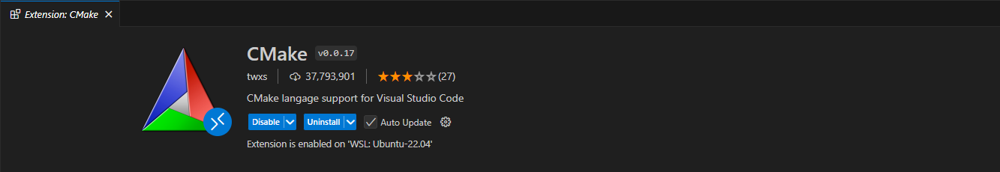

# WSL установка на windows

* Откройте PowerShell с правами администратора и выполните команду для активации WSL:

```shell
dism.exe /online /enable-feature /featurename:Microsoft-Windows-Subsystem-Linux /all /norestart
``` 

* После этого активируйте поддержку виртуализации (WSL 2)

```shell
dism.exe /online /enable-feature /featurename:VirtualMachinePlatform /all /norestart
``` 

* Перезагрузите компьютер

# Обновление ядра WSL 2

Чтобы использовать WSL 2, необходимо обновить ядро WSL. Для этого:

* Скачайте обновление ядра с официального сайта
  Microsoft: [WSL 2 Kernel Update](https://wslstorestorage.blob.core.windows.net/wslblob/wsl_update_x64.msi).
* Установите его, следуя инструкциям.

Установите WSL2 по умолчанию

``` shell
wsl --set-default-version 2
```

# Установка Ubuntu из Microsoft Store

* Откройте Microsoft Store и найдите Ubuntu.
* Нажмите «Получить» и дождитесь установки.

После завершения установки:

* Откройте Ubuntu из меню «Пуск» или через команду wsl в терминале.
* Следуйте инструкциям по настройке, задайте имя пользователя и пароль.

# Проверка версии WSL

Чтобы убедиться, что Ubuntu работает на WSL 2, выполните команду:

```shell
wsl -l -v
```

Если Ubuntu работает на WSL 1, вы можете переключить её на WSL 2:

```shell
wsl --set-version Ubuntu 2
```

# Запускаем WSL

Теперь у вас появилось приложение Ubuntu в списке приложения необходимо открыть его

В появившийся терминал вводим для обновления всех компонентов

```shell
sudo apt update
sudo apt upgrade
```

# Установка ROS2

## Все блоки выполнять построчно, это очень важно (БУДЬТЕ ВНИМАТЕЛЬНЫ)

## Установка Locale

Убедитесь, что ваша **Locale** поддерживает `UTF-8`. Если вы находитесь в минимальном окружении
(например, в контейнере docker), локаль может быть минимальной, например `POSIX`.
Мы тестируем со следующими настройками. Однако все должно быть в порядке,
если вы используете другую локаль с поддержкой `UTF-8`.

```shell
locale  # check for UTF-8
```

Если это не так, то воспользуйтесь следующими командами в терминале

```shell
sudo apt update && sudo apt install locales
sudo locale-gen en_US en_US.UTF-8
sudo update-locale LC_ALL=en_US.UTF-8 LANG=en_US.UTF-8
export LANG=en_US.UTF-8

locale  # verify settings
```

## Включите необходимые репозитории

Вам нужно будет добавить репозиторий ROS 2 apt в свою систему.

```shell
sudo apt install software-properties-common
sudo add-apt-repository universe  
```

Теперь добавьте ключ ROS 2 GPG с помощью apt.

```shell
sudo apt update && sudo apt install curl -y
sudo curl -sSL https://raw.githubusercontent.com/ros/rosdistro/master/ros.key -o /usr/share/keyrings/ros-archive-keyring.gpg
```

Затем добавьте репозиторий в список источников.

```shell
echo "deb [arch=$(dpkg --print-architecture) signed-by=/usr/share/keyrings/ros-archive-keyring.gpg] http://packages.ros.org/ros2/ubuntu $(. /etc/os-release && echo $UBUNTU_CODENAME) main" | sudo tee /etc/apt/sources.list.d/ros2.list > /dev/null
```

## Установите ROS 2

Обновите кэш репозиториев apt после установки репозиториев.

```shell
sudo apt update
```

Пакеты ROS 2 созданы на часто обновляемых системах Ubuntu. Перед установкой новых пакетов рекомендуется убедиться в том,
что ваша система обновлена.

```shell
sudo apt upgrade
```

Установка на рабочий стол (рекомендуется): ROS, RViz, демоверсии, учебники.

```shell
sudo apt install ros-rolling-desktop
```

## Настройка среды

```shell
echo "source /opt/ros/rolling/setup.bash" >> ~/.bashrc
source .bashrc
ros2
```

## Попробуем некоторые примеры

Если вы установили `ros-rolling-desktop`, вы можете попробовать несколько примеров.

В одном терминале запустите `C++ talker`:

```shell
ros2 run demo_nodes_cpp talker
```

В другом терминале запустите Python-приемник:

```shell
ros2 run demo_nodes_py listener
```

Вы должны увидеть, как `talker` говорит, что он `Publishing` сообщения, а `listener` говорит,
что `I heard` эти сообщения. Это подтверждает, что API на C++ и Python работают правильно. Ура!

# Настройка VS Code

## Пакеты необходимо в VS Code Extension (Ctrl + Shift + x)

Для начала необходимо будет установить пакет для работы с WSL


Затем установите официальное расширение для Ros от Microsoft


А также рекомендуется установить CMake


## Откройте VS Code через WSL

В терминале WSL и создайте директорию вашего ROS проекта:

```shell
mkdir -p ~/ros2_ws/src
cd ~/ros2_ws
```

Запустите VS Code из WSL:

```shell
code .
```

# Устанавливать зависимости и собирать свой первый проект мы уже будем на практике :)